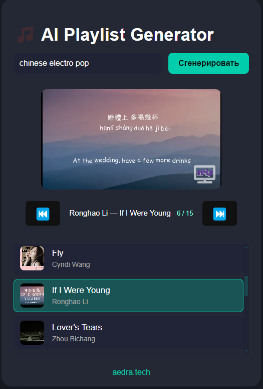
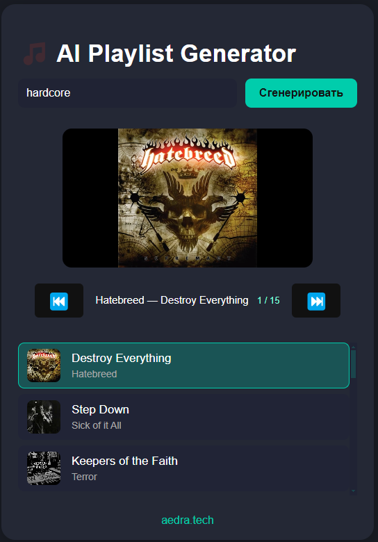

      
---
🟡 Что нужно всем
1. Скачайте yt-dlp.exe
Скачайте файл отсюда: https://github.com/yt-dlp/yt-dlp/releases

Поместите в папку: server/services/

Без этого файла поиск треков не будет работать.

2. Создайте и настройте .env
В папке server создайте файл `.env` со следующим содержимым:
```
OPENAI_API_KEY=sk-...        # Ваш OpenAI API-ключ
SONGS_COUNT=15               # Количество песен в плейлисте
OPENAI_MAX_TOKENS=300        # Лимит токенов для AI
PORT=3005                    # Порт сервера
#OPENAI_MODEL=gpt-3.5-turbo
OPENAI_MODEL=gpt-4o
#OPENAI_MODEL=gpt-4
```


В папке frontend создайте файл `.env`:
```
VITE_API_URL=http://localhost:3005/api/playlist   # Должен совпадать с портом сервера!
```

⚡ Лёгкий старт (рекомендуется)
Убедитесь, что Node.js установлен (версии 20+)

Выполните пункты из раздела “Что нужно всем” выше

Запустите батник установки зависимостей:

Дважды кликните install-deps.bat в корне проекта

Это автоматически установит все необходимые пакеты во всех подпапках

Запустите батник запуска:

Дважды кликните start-all.bat в корне проекта
(или выполните из консоли)

Откроются отдельные окна для сервера, фронта и Electron-приложения
---
⚙️ Продвинутый старт (ручной способ)
Установите зависимости вручную:

Откройте терминал/командную строку

Перейдите в каждую папку и выполните:

cd server
npm install

cd ../frontend
npm install

cd ../electron-app
npm install

Вернитесь в корень проекта

Запустите части по отдельности:

Сервер:
cd server
node server.js

Фронт:
cd frontend
npm run dev

Electron:
cd electron-app
npm run start
---
📁 Структура проекта
/server — backend (AI + yt-dlp интеграция)

/frontend — интерфейс пользователя (React/Vite)

/electron-app — десктоп-обёртка (Electron)

/server/services/yt-dlp.exe — бинарник yt-dlp (скачать вручную)

.env — настройки API и переменных

install-deps.bat — автоматическая установка зависимостей

start-all.bat — быстрый запуск всех частей


---
**Важно**
yt-dlp.exe должен быть скачан отдельно и лежать в server/services/.

.env обязательно нужен в каждой части (server, frontend).

Для работы нужен OpenAI API-ключ (получить на platform.openai.com).

Для запуска необходим Node.js (20+).

---

FAQ
Зачем Electron?
— Это снимает все браузерные ограничения и позволяет работать напрямую с файлами и внешними утилитами.
---
Можно ли обновить yt-dlp.exe?
— Да, просто скачайте новую версию и замените файл в server/services/.
---
Лицензия
MIT. Свободное некоммерческое использование.
---
Создавайте плейлисты и обходите любые ограничения!
---